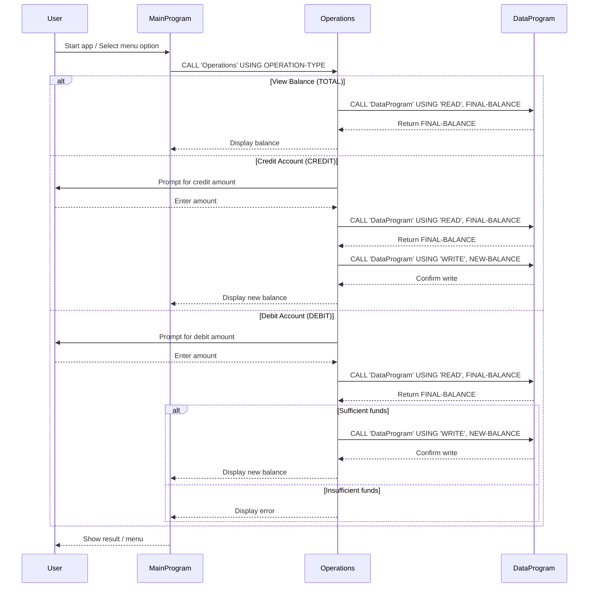

# COBOL Student Account Management System

This project implements a simple student account management system in COBOL. The system allows users to view their account balance, credit (add) funds, and debit (withdraw) funds, with all data managed in-memory for demonstration purposes.

## Purpose of Each COBOL File

### main.cob
- **Purpose:** Entry point and user interface for the application.
- **Key Functions:**
  - Displays a menu for account operations (View Balance, Credit, Debit, Exit).
  - Accepts user input and calls the appropriate operation via the `Operations` program.
- **Business Rules:**
  - Only allows menu choices 1-4. Invalid choices prompt the user again.
  - Exits cleanly when the user selects Exit.

### operations.cob
- **Purpose:** Handles the core business logic for account operations.
- **Key Functions:**
  - Receives the operation type from `main.cob` ("TOTAL ", "CREDIT", "DEBIT ").
  - For "TOTAL ": Calls `DataProgram` to read and display the current balance.
  - For "CREDIT": Prompts for an amount, reads the balance, adds the amount, writes the new balance, and displays it.
  - For "DEBIT ": Prompts for an amount, reads the balance, checks for sufficient funds, subtracts the amount if possible, writes the new balance, and displays it. If insufficient funds, displays an error message.
- **Business Rules:**
  - Debits are only allowed if the balance is sufficient.
  - All balance updates are performed via the `DataProgram`.

### data.cob
- **Purpose:** Manages the storage and retrieval of the account balance.
- **Key Functions:**
  - Receives operation type ("READ" or "WRITE") and a balance value.
  - For "READ": Returns the current stored balance.
  - For "WRITE": Updates the stored balance with the provided value.
- **Business Rules:**
  - The balance is initialized to 1000.00.
  - All read/write operations are in-memory (no persistent storage).

## Business Rules Summary
- The account starts with a balance of 1000.00.
- Only positive amounts can be credited or debited.
- Debits cannot exceed the current balance.
- All operations are performed in-memory for demonstration; no data is saved between runs.

---

## Sequence Diagram

---

For more details, see the source files in `src/cobol/`.
